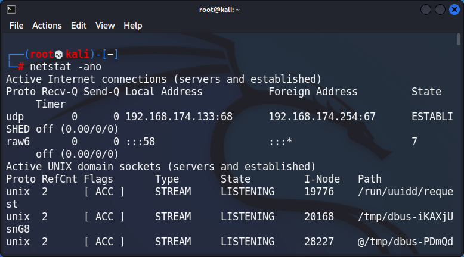

```bash
1. ifconfig
```
for checking ip address of a machine


```
```bash
2. ip a
```
new version of ifconfig


---
```bash
3. iwconfig
```
For checking wireless network(wifi) ip

If You are on a virtual machine and wifi adaptor is not connected
then it will not show anything


---
```
```bash
4. arp -a
```
Will show you every devices along with mac addresses those are connected to your network/device


---
```bash
5. ip n
```
new version of arp


---
```bash
6. ping 192.168.15.1
```
Ping is used to check is that host/ip is working or not 
(connectable or not)

![[ping.png]]

---
```bash
7. netstat -ano
```
What's open here, machine is talking with someone else, some like arp


---
```bash 
8. route
```
Where your traffic exits essential


---
```bash
9. ip r
```
new version of route
