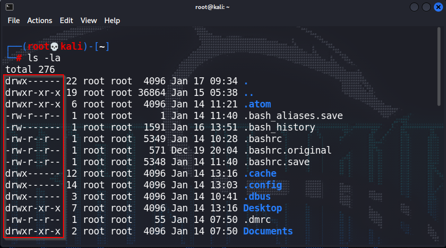
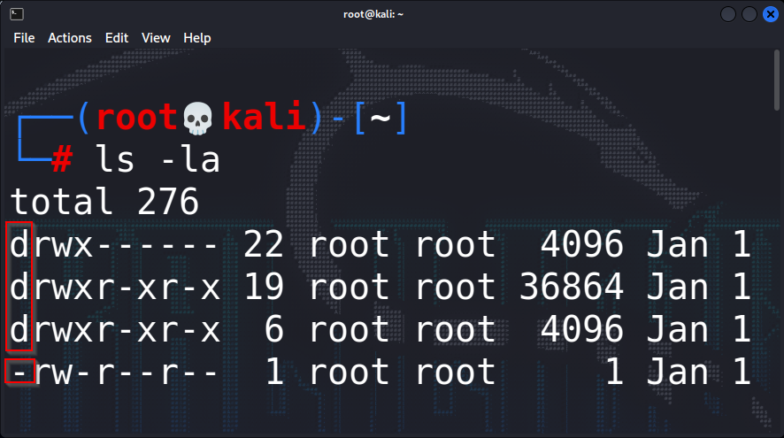
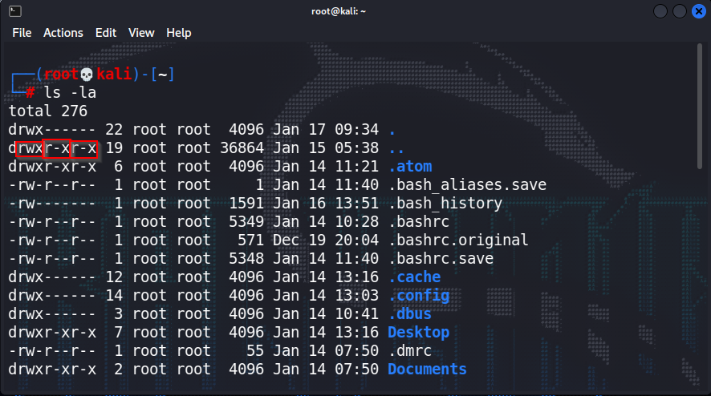
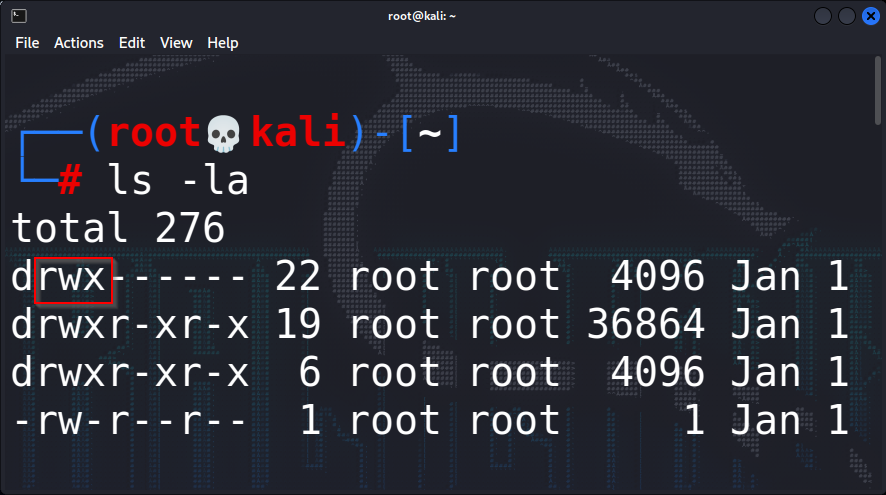
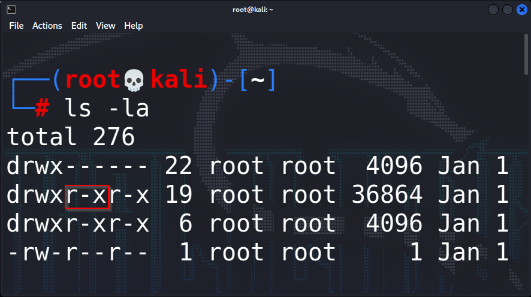
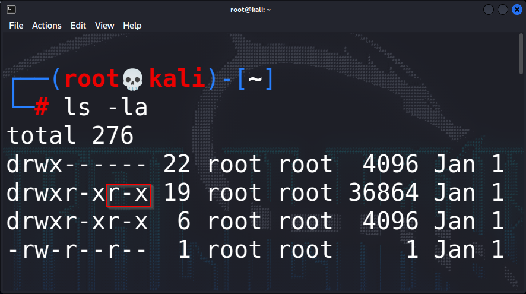
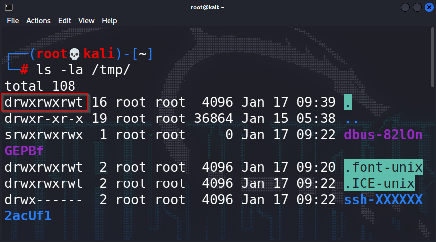

```bash
ls -la
```


---
`d` - directory
`-` - file

  

---
`rwx`
read write execute

---
```bash
rwxr-xr-x
```
3 groups are here
1- `rwx` 2- `r-x` 3- `r-w`



---
1. d`rwx`r-xr-x - Owner of the file
All permissions are there.
This permissions setting that particular group has
In this case can do read, write and execute.




---

2. drwx`r-x`r-x - Member of the group
Next set of three here is actually the permissions for the members of the group that own the file
In this case can do only read and execute.



---
3. drwxr-x`r-x` - For all the users on the machine
In this case we have read and execute permissions.



---
/tmp - dir is having all permissions


While hacking, we might actually upload it into the temp folder because that's where we can execute those files

It's all about insecure configurations.

