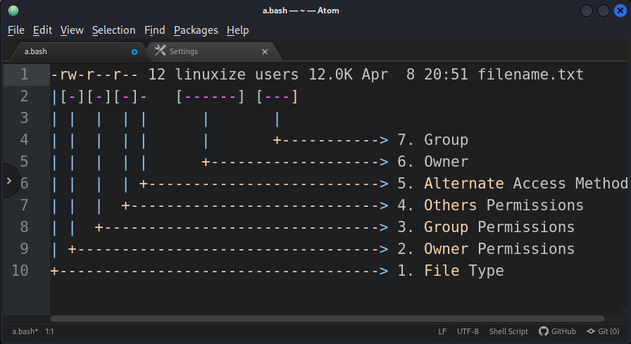
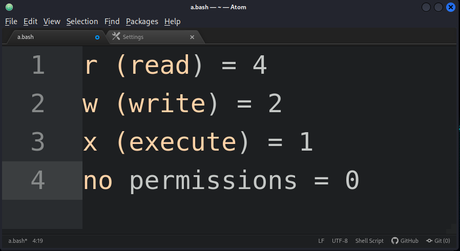
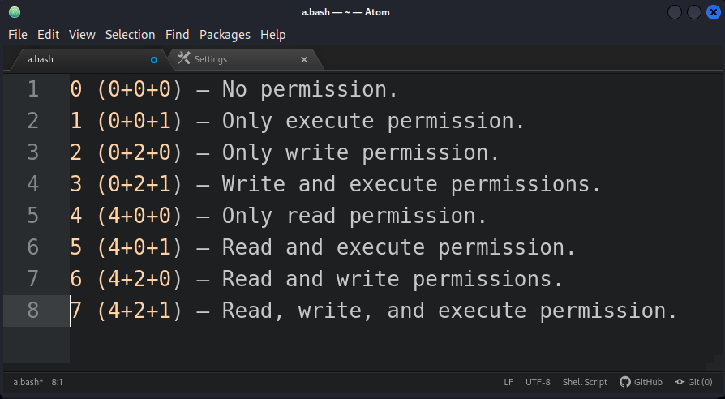
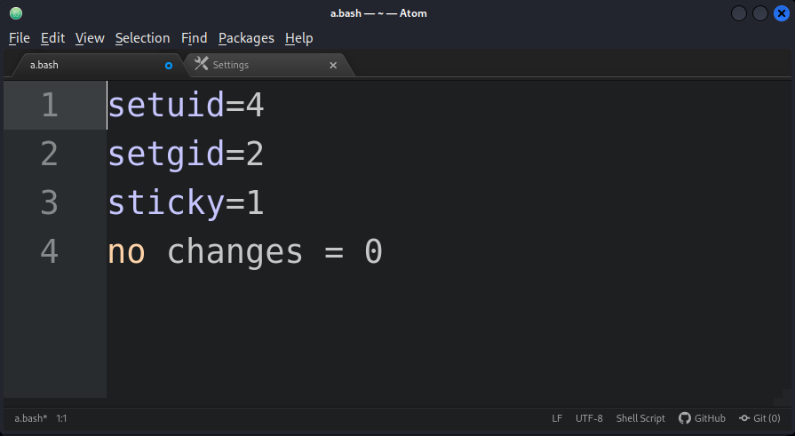

File permissions can be viewed using the `ls` command. 
Here is an example:

```bash
ls -l filename.txt
```



---

The write, read, and execute permissions have the following number value:



---

The permissions digit of a specific user class is the sum of the values of the permissions for that class.

Each digit of the permissions number may be a sum of `4, 2, 1` and `0`:



---

When the `4` digits number is used, the first digit has the following meaning:

