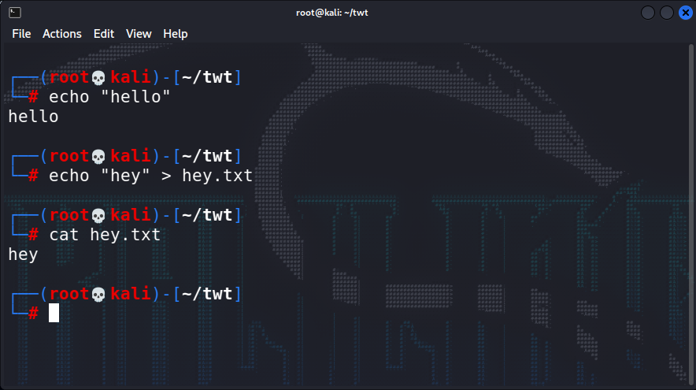
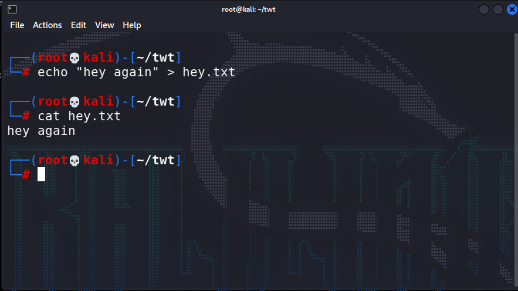
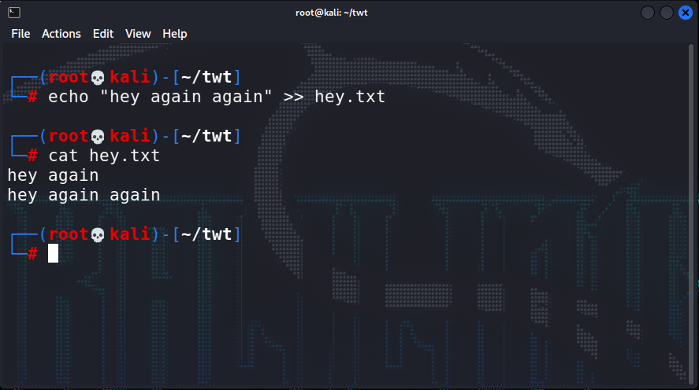
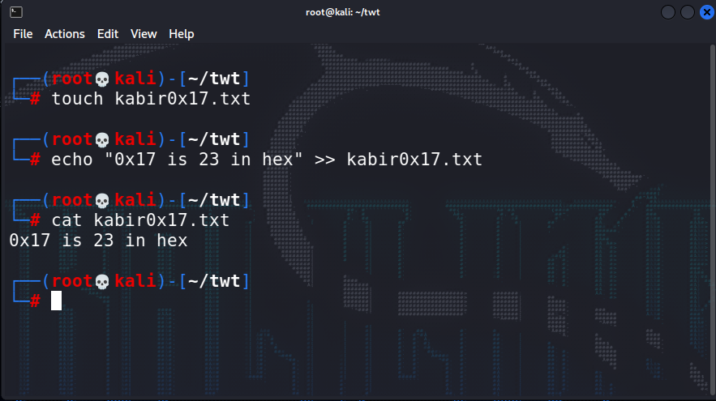

1. print the "hello"

```bash
┌──(root💀kali)-[~/twt]
└─ echo "hello"
```


2. Save "hello" into the files
```bash
┌──(root💀kali)-[~/twt]
└─ echo "hey" > hey.txt
```

```bash
┌──(root💀kali)-[~/twt]
└─ cat hey.txt
```


---
3. Appending data into file

```bash

┌──(root💀kali)-[~/twt]
└─ echo "hey again" > hey.txt
```
It overwrites hey again instead of append(add).



```bash

┌──(root💀kali)-[~/twt]
└─ echo "hey again again" >> hey.txt
```
Now this time with `>>` this got updated instead replaced.



---
Creating a empty file

```bash
┌──(root💀kali)-[~/twt]
└─ touch kabirOx17.txt
```
