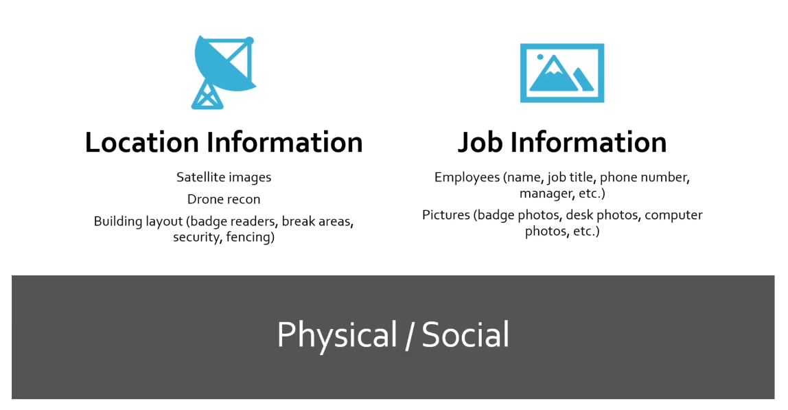
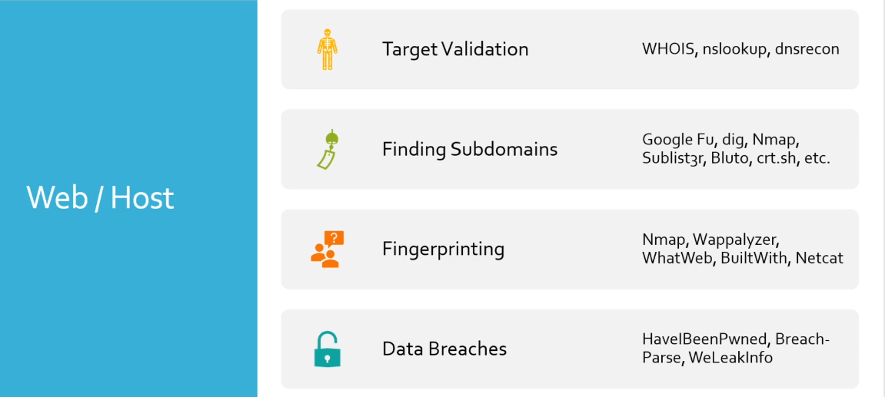

## Passive Reconnaissance Overview

## Physical / Social
---
### Physical:
Means actually going on sites and maybe doing a physical engagement or the social engineering aspect of maybe doing a fishing assessment or even including in a physical engagement

just gathering this information from the physical social aspect is incredibly useful

### Location Information:
- So we have location information so  we might utilize something like satellite images or often we'll go
- Drone recon we are trying to find out hey what is the building layout look like
	- Are there are break areas.
	- Does Security exists etc.

### Job Information:
- Employees (name, job title, phone number, manager, etc.)
- Pictures (badge photo, desk photos, computer photos, etc.)

---
## Web / Host assessment

### 1. Target Validation:
- Choosing the right target
- Verifying the target IP/host Ist
- Tools:
	- WHOIS, nslookup, dnsrecon
	
### 2. Finding Subdomains
- Sometimes More Subdomains == more chances of a bug
- Tools:
	- Google-Fu, dig, Nmap, Sublist3r, Bluto, crt .sh, etc.
	
### 3. Fingerprint:
- What services are running, is that apache, which port is open, which version of FTP is open.
	- Tools:
	Nmap, Wappalyzer, Whatweb, BuiltWith, Netcat
- On the passive side We're not touching any machine So we're not gonna be doing much scanning against the host
- We just have to utilize what kind of information might already be out there
- But as long as we're not scanning it, it's still passive

### 4. Data Breaches:
- breached information
- Tools:
	HavelBeenPwned, Breach-Parse, WeLeakInfo