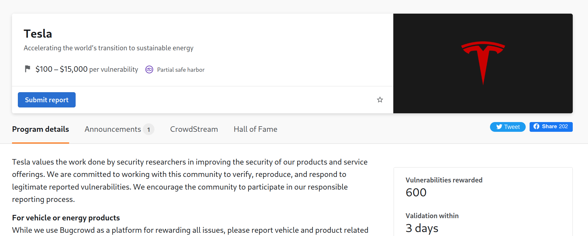
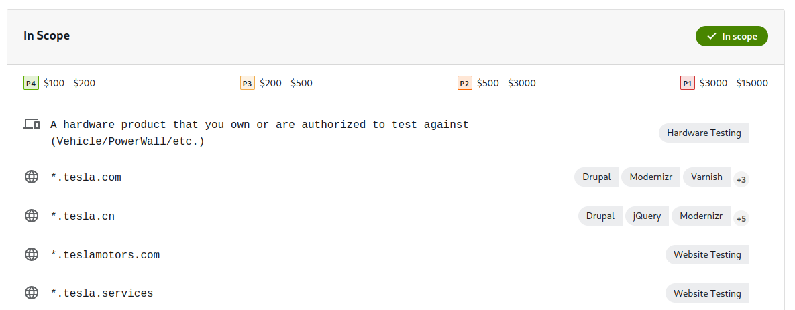
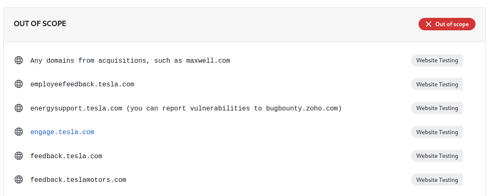

### 1. The First step

First step is to choose the target (from bugcrowd, HackerOne or aself-hosted program etc) In our case I choose tesla .com

---

\*.tesla.com
means all
means any subdomain that contains tesla .com in it, like 

- -> tesla .com
- -> beta.tesla .com 
- -> dev.tesla .com
    are included

---

### . out-of-scope:

these sub-domains are not included

- like feedback .tesla.com could
- it doesn't mean every domain can be in scope.
- in rare cases, people do get bounties from out-of-scope domains but it depends on the criticality of the bug.
- must check the subdomain before hunting.

