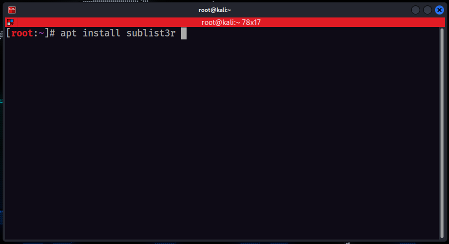
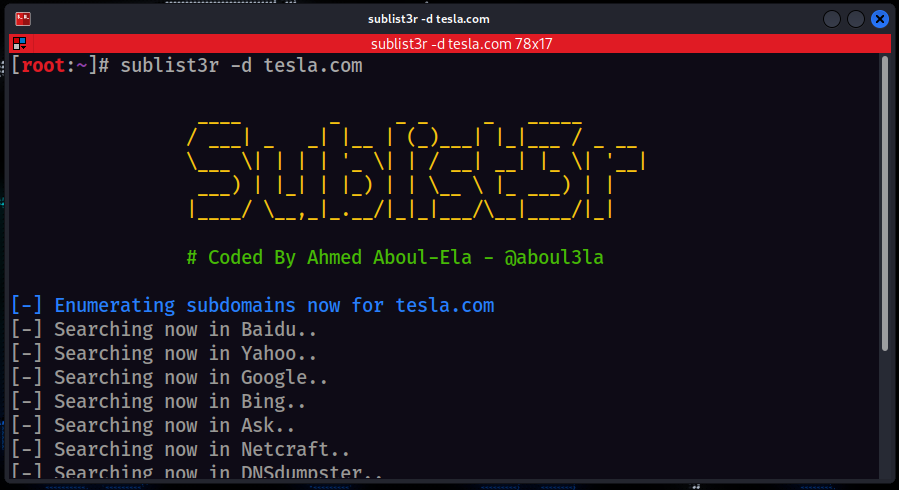
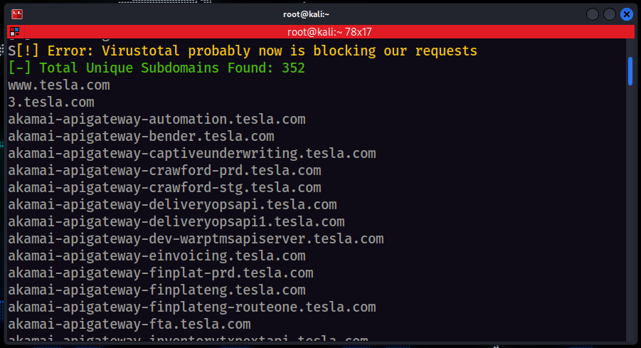
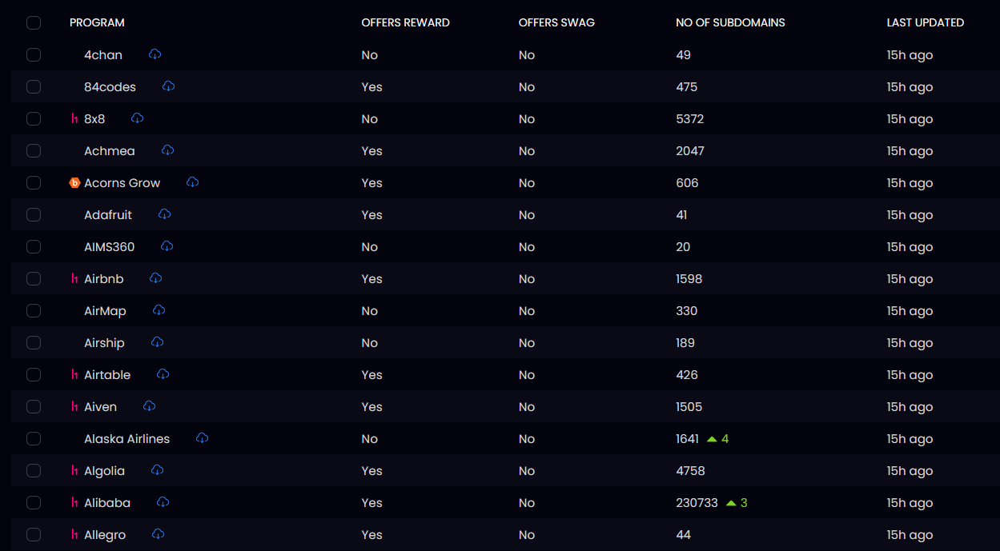
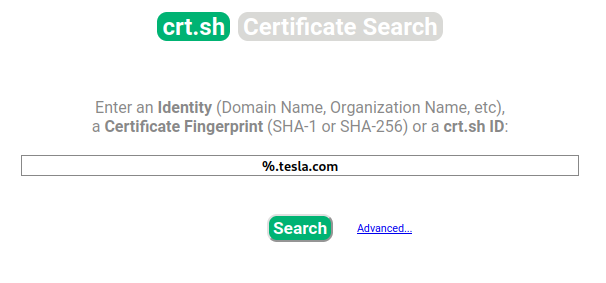

# Hunting Subdomains
if we are having a target
-> lenovo.com
then this -> dev.lenovo.com, beta.lenovo.com are subdomains
If do we hunt on subdomains, chances are more to find a bug.

---
[ Topic - Hunting Subdomains ]

- We can use different types of tools and then combined their result to get more sub-domains
- [ tools ] - amass, sublist3r, subfinder, asetfinder etx
 

---
We also can use websites to find sub-domains
[ Websites ] -
#### 1. chaos.projectdiscovery.io

#### 2. crt.sh

