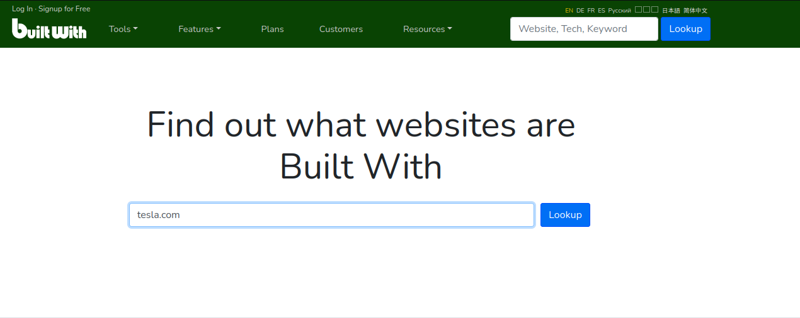
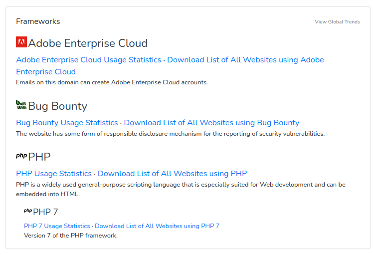
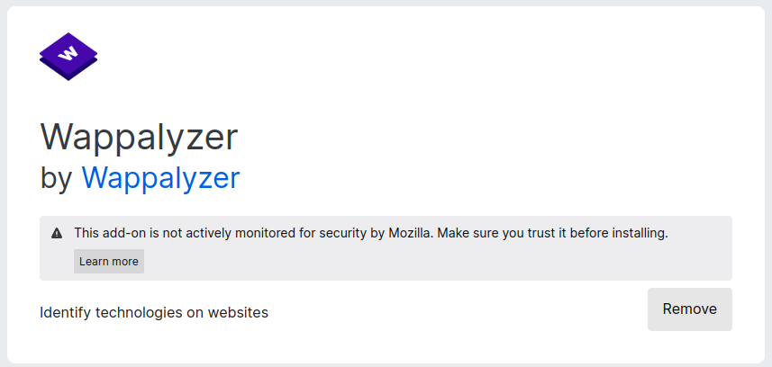
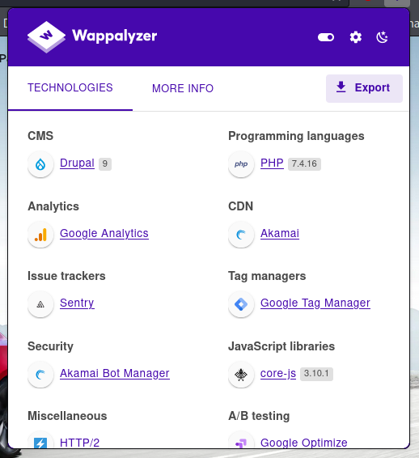
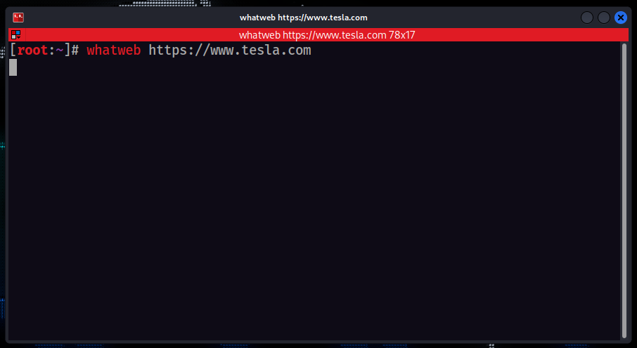
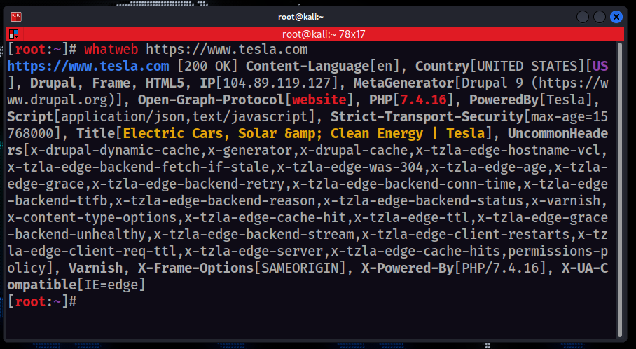

# Identifying Website Technologies
We have to check first on which language website is built on and which technologies are being used by the Website

We have some tools to check languages and technologies that are being used

#### 1. bulitwith (website)

---
#### 2.  wappalyzer (browser extension)

---
#### 3. whatweb (tool)

