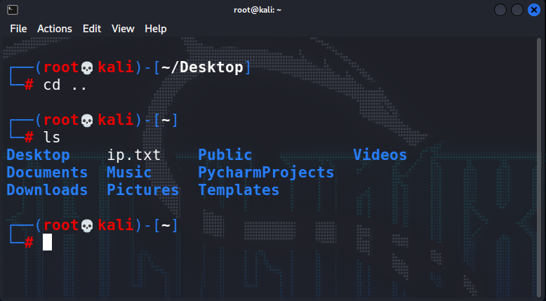
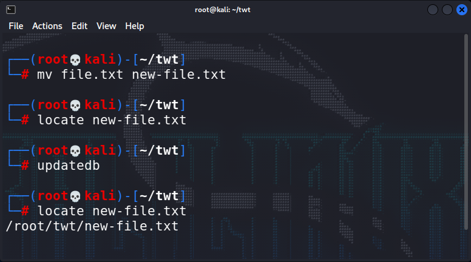

```bash 
1. pwd
```
print current directory


---
```bash 
2. `cd ~/Desktop`
```
`~/` is your home directory - root


---
```bash
3. cd ..
```
One directory back



---
```bash
4. ls
``` 
list


---
```bash
5. mkdir
```
create a folder/directory


---
```bash 
6. rm -r kabir
```
use `-r`  for removing folder


---
```bash
7. ls -la
```
list hidden files


---
```bash
8. echo "hi" > file.txt
```
is used for print `hi` and `>` is used to store that msg in `file.txt`


---
```bash
9. cat file.txt
```
for view the content of the file


---
```bash
10. cp file.txt twt/
```
copy file.txt to twt-folder 


---
```bash
11. mv file.txt twt/
```
in this mv will move the file to twt


---
```bash
12. mv file.txt new-file.txt
```
will rename the file



---
```bash
13. `locate` 
```
locate will find the file


---
```bash
14. `updatedb` 
```
if file is new updatedb will update the database after that you can see we are able to get the file location

